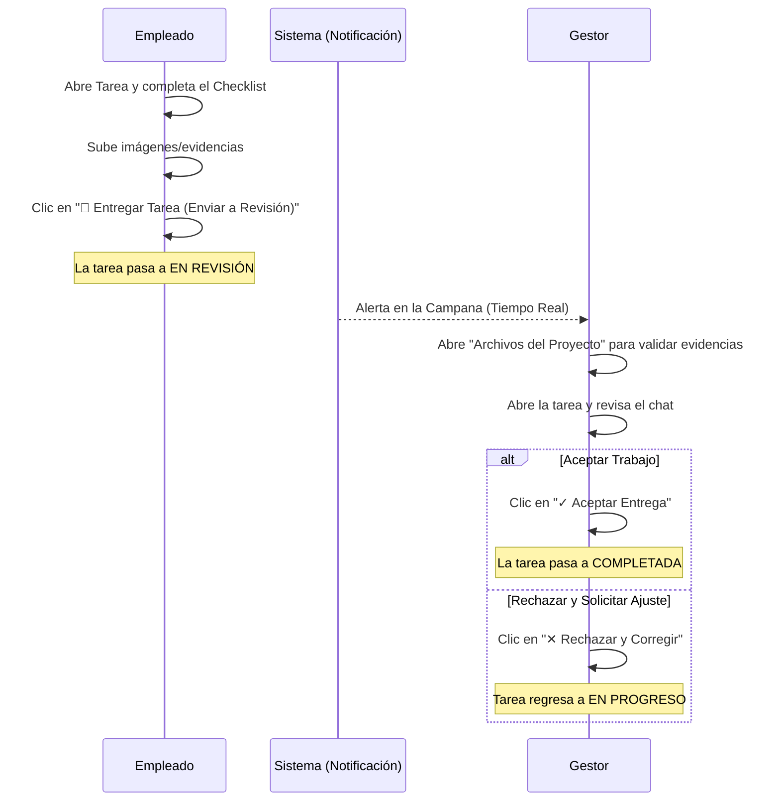

# 📘 Manual de Usuario - GestProyectos

> [!TIP]
> **¿Cómo personalizar este manual con capturas reales de tu sistema?**
> He configurado el manual para leer imágenes directamente de la carpeta de tu proyecto en `apps/web/public/manual/`. 
> Para que el manual muestre capturas reales de tu propia empresa (con tus proyectos y colaboradores reales):
> 1. Abre tu aplicación en el navegador.
> 2. Toma una captura de pantalla (Print Screen / Impr Pant) de las secciones correspondientes.
> 3. Guarda y reemplaza los archivos en tu carpeta local:
>    * El Dashboard como: `apps/web/public/manual/dashboard.png`
>    * El Tablero Kanban como: `apps/web/public/manual/tablero.png`
>    * El Chat de la Tarea como: `apps/web/public/manual/chat.png`
> Al subirlos, el manual se actualizará de inmediato con las fotos reales de tu sistema.

---

## 👥 1. Roles y Permisos en el Sistema

El sistema cuenta con un control de accesos basado en roles para asegurar que cada miembro de la organización acceda únicamente a las opciones correspondientes:

| Rol | Permisos Principales | Destinatarios |
| :--- | :--- | :--- |
| **Gestor / Administrador** (`MANAGER` / `COMPANY_ADMIN`) | Crear proyectos, crear tareas rápidas o completas, administrar equipos de trabajo, reordenar el tablero Kanban, configurar la empresa y cambiar contraseñas. | Dueños de empresas, Directores de Proyecto, Managers. |
| **Colaborador / Empleado** (`EMPLOYEE`) | Ver proyectos asignados, actualizar estado de sus tareas (Kanban), completar elementos del checklist y **subir evidencias de entrega**. | Desarrolladores, Diseñadores, Personal Técnico. |

---

## 🖥️ 2. Explicación Detallada de las Secciones de la App

### 🏠 A. Dashboard (Panel de Inicio)
El Dashboard es la pantalla de bienvenida y el centro de control de tu empresa. Ofrece un resumen en tiempo real sobre la productividad y el avance global.

* **Qué hace:** Muestra tarjetas de métricas clave (Proyectos Activos, Tareas Totales, Integrantes del Equipo) y un gráfico visual de rendimiento.
* **Quién lo usa:** Todos los usuarios. Los gestores ven el resumen general de toda la empresa, mientras que los colaboradores visualizan las métricas correspondientes a sus proyectos y asignaciones activas.

---

### 📂 B. Proyectos (Predeterminado en Vista de Etapas)
Es la sección principal de administración. Al ingresar, verás la lista de proyectos en la **Vista de Etapas** predeterminada para una mejor organización de las fases.

* **Qué hace:** 
  1. Permite agrupar los proyectos en etapas editables (como "Pendientes", "En Proceso", "Completados").
  2. Ofrece la opción de crear un **"Nuevo Proyecto"** (exclusivo para Gestores), asignarle un equipo de trabajo y prioridades.
  3. Contiene la barra de búsqueda rápida y filtros por empresa/equipo.
* **Botones e Interactividad:**
  * **Botón "+ Nuevo Proyecto"**: Abre el modal de creación.
  * **Botón "Cuadrícula / Etapas"**: Permite cambiar la forma en la que se visualizan los proyectos.
  * **Doble clic en Etapa**: Permite a los gestores renombrar las etapas del proyecto en vivo.

---

### 📋 C. Detalle del Proyecto y Tablero Kanban de Tareas
Al hacer clic sobre cualquier proyecto, entrarás a su tablero Kanban interactivo.

* **Qué hace:** Administra las tareas individuales mediante un flujo de arrastrar y soltar (drag and drop) de izquierda a derecha. Las columnas son: **Pendientes**, **En Proceso**, **En Revisión** y **Completadas**.
* **Botones e Interactividad:**
  * **Botón "+ Nueva Tarea"**: (Solo visible para Gestores) Permite crear tareas completas con descripción, prioridad y responsable.
  * **Agregar tarea rápida**: Input al final de cada columna para crear tareas ágiles escribiendo el título y presionando Enter.
  * **Filtro de Responsables**: Al crear una tarea, la lista de usuarios se filtra automáticamente mostrando únicamente a los miembros del equipo asignado al proyecto.

---

### 🗂️ D. Pestaña "Archivos del Proyecto" (Consolidación de Evidencias)
Dentro del detalle del proyecto, al lado del botón Tablero, se encuentra la sección de archivos.

* **Qué hace:** Centraliza la administración de archivos en dos secciones:
  1. **Archivos Generales del Proyecto**: Documentos subidos por los gestores para consulta de todos.
  2. **Evidencias y Entregas de Tareas**: Muestra en tiempo real **todas las pruebas cargadas por los empleados** en los checklists de sus respectivas tareas. Especifica a qué tarea pertenece, qué subtarea valida, quién lo subió y la fecha de entrega.
* **Botones e Interactividad:**
  * **Botón "Previsualizar" (Icono de Ojo)**: Abre fotos, imágenes y PDFs directamente en el navegador sin tener que descargarlos.
  * **Botón "Descargar" (Icono de Flecha hacia abajo)**: Guarda el archivo en tu equipo.

---

### 💬 E. Chat de la Tarea en Vivo (Drawer de Detalles)
Al hacer clic en cualquier tarjeta de tarea, se despliega el panel lateral (Drawer) con toda su información detallada y el **Chat de la Tarea** permanente en la parte inferior.

* **Qué hace:** Permite que los responsables y gestores conversen en tiempo real sobre la tarea específica, envíen mensajes de texto y **suban imágenes y archivos adjuntos** directamente al chat de forma visible e inmediata.
* **Botones e Interactividad:**
  * **Botón de Clip (Adjuntar)**: Permite subir imágenes o documentos al chat. Las imágenes se muestran interactivas dentro de la conversación y los archivos quedan como botones de descarga rápida.
  * **Checklist con evidencias**: Cada tarea puede tener subtareas de control. Los colaboradores marcan sus avances y adjuntan pruebas técnicas en cada punto específico.

---

### 📅 F. Calendario
Muestra la planificación de las tareas distribuidas a lo largo del mes en un formato visual.
* **Qué hace:** Ayuda a los gestores y empleados a visualizar las fechas límite de entrega para planificar mejor sus jornadas. Las tareas aparecen coloreadas según su estado de ejecución.

---

### ⚙️ G. Configuración
* **Qué hace:** 
  1. **Empresa:** Cambiar el nombre comercial de la organización y actualizar el logotipo del sistema.
  2. **Seguridad:** Permite a todos los usuarios cambiar su contraseña de acceso de forma segura (validando la contraseña actual).

---

## 🔄 3. Flujo Completo de Aprobación de Tareas (Paso a Paso)

### 1. Preparación del Empleado
Cuando el colaborador completa las subtareas de la actividad, sube las imágenes o PDFs que avalan su trabajo y da clic en **"Entregar Tarea (Enviar a Revisión)"**.

### 2. Notificación en la Campana
El sistema genera automáticamente una alerta para todos los gestores de la empresa:
> *"Tarea EN REVISIÓN: [Nombre del Empleado] marcó la tarea [Título] como EN REVISIÓN"*.
Al hacer clic en la alerta, el gestor es llevado directamente al tablero del proyecto.

### 3. Validación y Aprobación
El Gestor puede ir a la pestaña **Archivos del Proyecto** para ver todas las evidencias recopiladas sin tener que buscar tarea por tarea. Al abrir los detalles de la tarea, tendrá dos opciones de decisión:
* **Aceptar Entrega**: Pasa la tarea a **Completada**.
* **Rechazar y Corregir**: Regresa la tarea a **En Progreso** para que el empleado haga las correcciones necesarias y vuelva a entregarla.
