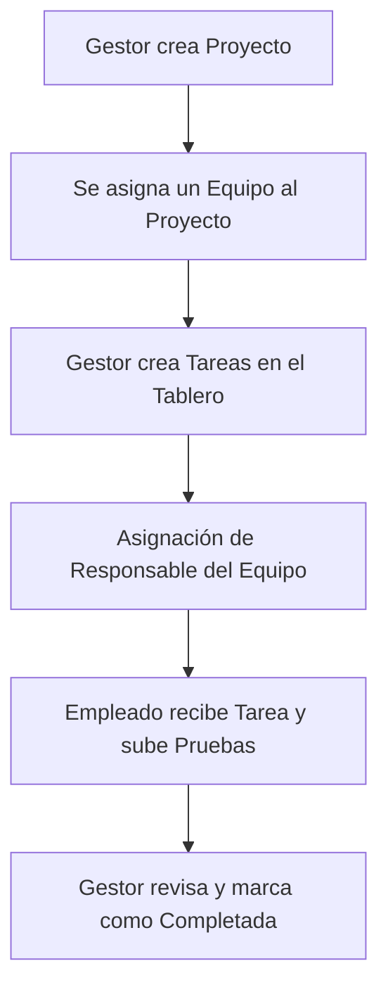

# 📘 Manual de Usuario - GestProyectos

¡Bienvenido al sistema **GestProyectos**! Esta guía detalla el funcionamiento del sistema, los roles disponibles y las principales pantallas para facilitar su uso y adopción en la empresa.

---

## 👥 1. Roles y Permisos en el Sistema

El sistema cuenta con un control de accesos basado en roles para asegurar que cada miembro de la organización acceda únicamente a las opciones correspondientes:

| Rol | Permisos Principales | Destinatarios |
| :--- | :--- | :--- |
| **Gestor / Administrador** (`MANAGER` / `COMPANY_ADMIN`) | Crear proyectos, crear tareas rápidas o completas, administrar equipos de trabajo, reordenar el tablero Kanban, configurar la empresa y cambiar contraseñas. | Dueños de empresas, Directores de Proyecto, Managers. |
| **Colaborador / Empleado** (`EMPLOYEE`) | Ver proyectos asignados, actualizar estado de sus tareas (Kanban), completar elementos del checklist y **subir evidencias de entrega**. | Desarrolladores, Diseñadores, Personal Técnico. |

---

## 🗂️ 2. Flujo de Trabajo y Funcionalidades Clave

### 🔹 A. Creación y Visualización de Proyectos
1. Diríjase a la sección **Proyectos** desde el menú lateral o inferior.
2. Si cuenta con rol de **Gestor**, presione el botón **"Nuevo Proyecto"**.
3. Complete los campos requeridos: nombre, descripción, prioridad, fechas y asigne el **Equipo de trabajo** correspondiente.
4. El listado de proyectos puede visualizarse en modo **Cuadrícula (Grid)** o agrupado por **Etapas de desarrollo**.

### 🔹 B. Creación de Tareas (Exclusivo de Gestores)
* Para garantizar el orden en el flujo de trabajo, **los colaboradores no visualizan los botones de creación de tareas**.
* Los gestores pueden crear tareas de dos formas:
  1. **Creador Completo:** Mediante el botón **"Nueva Tarea"** ubicado en el encabezado del proyecto, donde se puede definir descripción, prioridad, fecha límite y responsable.
  2. **Creador Rápido (Inline):** En la parte inferior de cada columna del tablero Kanban, escribiendo un título y presionando Enter.

### 🔹 C. Asignación Inteligente de Colaboradores
* Al crear o editar una tarea dentro de un proyecto, el selector de **Responsable** se filtra de forma inteligente.
* **Filtro Automático:** Si el proyecto está asignado a un equipo específico (por ejemplo, "Desarrollo de Software"), en el listado de responsables **únicamente aparecerán los miembros asociados a dicho equipo**. Esto evita asignar tareas a personal de otras áreas por error.

### 🔹 D. Gestión de Entregas y Subida de Evidencias (Empleados)
1. El empleado asignado abre la tarea haciendo clic sobre ella en el tablero Kanban.
2. Dentro del panel de detalles, en la sección de **Checklist**, el colaborador puede marcar las subtareas asignadas.
3. Para justificar el avance, cuenta con el botón **"Subir evidencia"** en cada elemento del checklist.
4. Puede adjuntar capturas de pantalla, PDFs o documentos técnicos que verifiquen la realización del trabajo.

---

## ⚙️ 3. Configuración y Seguridad

Desde la sección de **Configuración** (`/dashboard/settings`), los usuarios pueden gestionar su información personal y de seguridad:

1. **Detalles de la Empresa (Gestores):** Modificación del nombre comercial y logotipo que se visualiza en la aplicación.
2. **Cambiar Contraseña (Todos los usuarios):** 
   * Ingrese su contraseña actual.
   * Defina la nueva contraseña (mínimo 6 caracteres).
   * Confirme la contraseña e introduzca los cambios. El sistema validará la autenticidad y la actualizará de inmediato sin cerrar su sesión activa.

---

## 👁️ 4. Características de Accesibilidad Visual (Mejora de Contraste)

La interfaz se ha rediseñado pensando en personas que requieren una mayor legibilidad:
* **Escala de Fuentes Aumentada:** El tamaño de la letra base y de los elementos interactivos se incrementó un **37%** de forma general.
* **Iconografía Reforzada:** Los trazos de los iconos son más gruesos y definidos (`stroke-width: 2.2px`).
* **Mayor Contraste en Modo Oscuro:** El fondo es un azul noche oscuro puro (`#030712`) y los textos utilizan fuentes color blanco tiza (`#f8fafc`), evitando grises tenues que dificulten la lectura.
