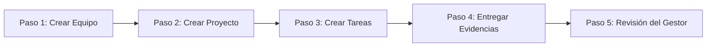

# 📘 Manual de Usuario - GestProyectos

> [!TIP]
> **¿Cómo personalizar este manual con capturas reales de tu sistema?**
> He configurado el manual para leer imágenes directamente de la carpeta de tu proyecto en `apps/web/public/manual/`. 
> Para que el manual muestre capturas reales de tu propia empresa (con tus proyectos y colaboradores reales):
> 1. Abre tu aplicación en el navegador.
> 2. Toma una captura de pantalla (Print Screen / Impr Pant) de las secciones correspondientes.
> 3. Guarda y reemplaza los archivos en tu carpeta local:
>    * El Dashboard como: `apps/web/public/manual/dashboard.png`
>    * El Tablero Kanban como: `apps/web/public/manual/tablero.png`
>    * El Chat de la Tarea como: `apps/web/public/manual/chat.png`
> Al subirlos, el manual se actualizará de inmediato con las fotos reales de tu sistema.

---

## 👥 1. Roles y Permisos en el Sistema

El sistema cuenta con un control de accesos basado en roles para asegurar que cada miembro de la organización acceda únicamente a las opciones correspondientes:

| Rol | Permisos Principales | Destinatarios |
| :--- | :--- | :--- |
| **Gestor / Administrador** (`MANAGER` / `COMPANY_ADMIN`) | Crear proyectos, crear tareas rápidas o completas, administrar equipos de trabajo, reordenar el tablero Kanban, configurar la empresa y cambiar contraseñas. | Dueños de empresas, Directores de Proyecto, Managers. |
| **Colaborador / Empleado** (`EMPLOYEE`) | Ver proyectos asignados, actualizar estado de sus tareas (Kanban), completar elementos del checklist y **subir evidencias de entrega**. | Desarrolladores, Diseñadores, Personal Técnico. |

---

## 🖥️ 2. Explicación de las Secciones de la App

### 🏠 A. Dashboard (Panel de Inicio)
El Dashboard es la pantalla de bienvenida y el centro de control de tu empresa. 

* **Qué hace:** Ofrece un resumen en tiempo real sobre los proyectos activos, tareas pendientes, tareas completadas, colaboradores del equipo y el rendimiento global del mes.
* **Quién lo usa:** Todos los usuarios lo visualizan al entrar al sistema.

---

### 📂 B. Proyectos (Predeterminado en Vista de Etapas)
Es el lugar donde se administran y estructuran los proyectos de la empresa.

* **Qué hace:** 
  1. Permite crear proyectos asignándoles un equipo y prioridades.
  2. Organiza los proyectos en columnas según su fase actual (Pendiente, En Progreso, Completado).
  3. Contiene la barra de búsqueda y filtros rápidos.

---

### 📋 C. Tablero de Tareas (Kanban)
Al hacer clic sobre cualquier proyecto, entrarás a su tablero Kanban interactivo de tareas.
* **Qué hace:** Permite crear y mover las tareas a través de las columnas: **Pendientes**, **En Proceso**, **En Revisión** y **Completadas**.
* **Quién lo usa:** Los gestores crean y asignan tareas; los colaboradores las actualizan a medida que avanzan.

---

### 🗂️ D. Archivos del Proyecto
* **Qué hace:** Centraliza todos los archivos cargados. Muestra por separado los archivos generales del proyecto y las **evidencias de tareas** subidas por los colaboradores (indicando la tarea, subtarea y quién la subió).

---

### 💬 E. Chat de la Tarea en Vivo (Drawer de Detalles)
Al abrir cualquier tarea, se despliega el panel con sus detalles y el chat en vivo permanente en la parte inferior.

* **Qué hace:** Permite conversar sobre la tarea en tiempo real y **adjuntar archivos e imágenes** directamente en los mensajes de chat para máxima comodidad de comunicación.

---

### 📅 F. Calendario
* **Qué hace:** Muestra de forma visual las tareas agendadas distribuidas en el calendario mensual para controlar los plazos de entrega.

---

## 🚀 3. Flujo Lógico de Uso: Paso a Paso (Puesta en Marcha)

Para utilizar la aplicación de manera óptima por primera vez, sigue este orden de pasos:

### ➡️ Paso 1: Crear Equipos y Registrar Colaboradores
1. Ve a la sección **Empresas** (o Equipos).
2. Crea los equipos correspondientes a tu organización (ej: "Desarrollo de Software", "Marketing").
3. Agrega a los empleados a su equipo de trabajo respectivo.

### ➡️ Paso 2: Crear el Proyecto
1. Dirígete a la sección **Proyectos**.
2. Presiona **"+ Nuevo Proyecto"** (sólo gestores).
3. Escribe el nombre, descripción, fechas y **selecciona el Equipo asignado** en el Paso 1.

### ➡️ Paso 3: Crear y Asignar Tareas
1. Entra al proyecto creado.
2. Presiona **"+ Nueva Tarea"** para abrir el creador o usa la barra rápida de la columna.
3. El sistema te permite seleccionar **hasta 2 responsables** simultáneamente usando checkboxes. El listado filtrará automáticamente para mostrar **únicamente a los empleados del equipo asignado al proyecto** (evitando asignaciones incorrectas). En el tablero Kanban, las iniciales de ambos responsables aparecerán de forma apilada en la tarjeta.

### ➡️ Paso 4: Trabajo y Entrega (Empleado)
1. El empleado abre su tarea en el tablero y la arrastra a **"En Proceso"**.
2. Escribe sus dudas y **sube imágenes y archivos** en el **Chat en vivo** de la tarea.
3. En el Checklist, sube las evidencias técnicas correspondientes.
4. Presiona el botón **"🚀 Entregar Tarea (Enviar a Revisión)"** en el panel.

### ➡️ Paso 5: Aprobación / Cierre (Gestor)
1. El gestor recibe una notificación en la campana de que la tarea está lista.
2. Abre la pestaña **Archivos del Proyecto** para ver todas las evidencias acumuladas sin necesidad de buscar en cada tarea.
3. Abre los detalles de la tarea y selecciona:
   * **✓ Aceptar Entrega**: La tarea pasa a **Completada**.
   * **✕ Rechazar y Corregir**: La tarea regresa a **En Progreso** para que el empleado haga las correcciones oportunas.
